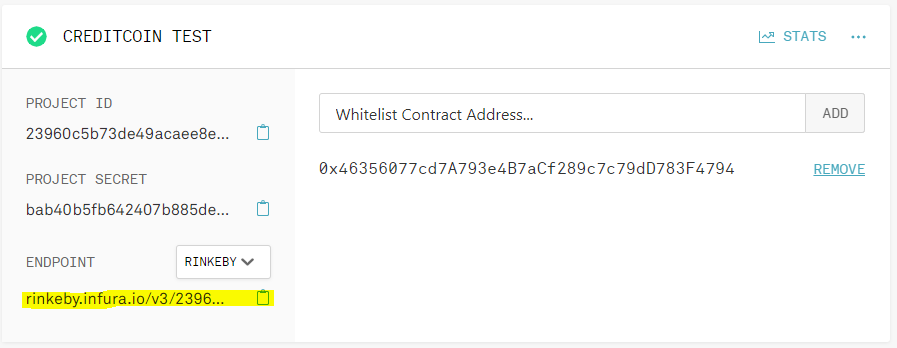
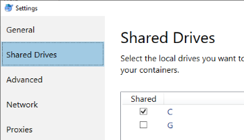

#  Creditcoin Public Testnet

## Introduction

Before Creditcoin launches on the livenet, we're giving you an opportunity to try it out on the Rinkeby Ethereum Test Network ("testnet"), which simulates Ethereum, or against your own Testnet Bitcoin node. This gives you a chance to get a better understanding of Creditcoin, and how it works, before real assets are involved.

Please note that ether, bitcoin and tokens on a testnet are easy to obtain, and do not carry any real-world value.


## Preparation

Before you get started, there are a few things which you'll need to have:
* An Ethereum address public and private key (https://kb.myetherwallet.com/getting-started/creating-a-new-wallet-on-myetherwallet.html)
* A Rinkeby Ethereum RPC testnet node (Easier - See https://infura.io/docs for details) or your own private RPC testnet node (More advanced setup)


* Docker Desktop<sup>1</sup> (https://www.docker.com/products/docker-desktop)
* A clone or zip of the Creditcoin Public Testnet GitHub repository (https://github.com/gluwa/CreditcoinPublicTestnet)

<sup>1</sup> Make sure you allow Docker to access the drive that the Creditcoin containers will be running on by opening Docker Desktop settings and checking the drive under the `Shared Drives` section. See https://docs.docker.com/docker-for-windows/#shared-drives for more information.  



## Configuration

### Client Configuration

#### Client/clientConfig.json
```json
{
  "signer": "<256_bit_key_secp256k1_ECDSA>",
  "creditcoinRestApiURL": "",
  "bitcoin": {
    "secret": "<bitcoin_private_key>",
    "rpc": "<bitcoin_rpc_node_url>",
    "credential": "<rpc_username:rpc_password>",
    "confirmationsCount": "1",
    "fee": "10000"
  },
  "ethereum": {
    "creditcoinContract": "<creditcoinContract>",
    "creditcoinContractAbi": "<creditcoinContractAbi>",
    "rpc": "<ethereum_node_url>",
    "confirmationsCount": "1",
    "secret": "<ethereum_private_key_no_0x>",
    "gasPriceInGwei":  "<set_to_override_gas_price>"
  }
}
```

 * signer: *Your 256 bit SECP256K1 ECDSA key*
 * creditcoinRestApiURL: *Leave blank*
 * bitcoin - This section can be left blank if you do not intend to loan/fundraise Bitcoin
   * secret: *Your bitcoin private key*
   * rpc: *Your bitcoin RPC node*
   * credential: *Your RPC credentials*
   * confirmationsCount: This can be set to `1` for testnet purposes
   * fee: Bitcoin transaction fee (e.g. `10000`)
 * ethereum - **Must be completed with the values below for Public Testnet. Contract must be lowercase**
   * creditcoinContract: `0x46356077cd7a793e4b7acf289c7c79dd783f4794`
   * creditcoinContractAbi:  
   ```
   [{'constant':false,'inputs':[{'name':'tokens','type':'uint256'},{'name':'sighash','type':'string'}],'name':'burn','outputs':[{'name':'success','type':'bool'}],'payable':false,'stateMutability':'nonpayable','type':'function'},{'constant':false,'inputs':[{'name':'tokens','type':'uint256'},{'name':'sighash','type':'string'}],'name':'exchange','outputs':[{'name':'success','type':'bool'}],'payable':false,'stateMutability':'nonpayable','type':'function'},{'anonymous':false,'inputs':[{'indexed':false,'name':'burner','type':'address'},{'indexed':false,'name':'amount','type':'uint256'},{'indexed':false,'name':'sighash','type':'string'}],'name':'Exchanged','type':'event'},{'anonymous':false,'inputs':[{'indexed':false,'name':'amount','type':'uint256'}],'name':'strLen','type':'event'},{'constant':true,'inputs':[{'name':'tokenOwner','type':'address'}],'name':'balanceOf','outputs':[{'name':'balance','type':'uint256'}],'payable':false,'stateMutability':'view','type':'function'}]
   ```
   * rpc: The Rinkeby Infura RPC testnet node (e.g. `https://rinkeby.infura.io/xxxxxxxxxxxx`) or your own personal testnet node (e.g. http://localhost:8545) that you set up during [the Preparation step](#Preparation)
   * confirmationsCount: This can be set to `1` for testnet purposes
   * secret: *Your ethereum private key without the `0x` prefix*
   * gasPriceInGwei: Can be left blank unless you know what you're doing

### Node and Gateway Configuration

#### Server/gatewayConfig.json
```
{
    "bindIP": "0.0.0.0",
    "bitcoin": {
        "rpc": "<bitcoin_rpc_node_url>",
        "credential": "<rpc_username:rpc_password>",
        "confirmationsCount": "1"
    },
    "ethereum": {
        "creditcoinContract": "<creditcoinContract>",
        "creditcoinContractAbi": "<creditcoinContractAbi>",
        "rpc": "<ethereum_node_url>",
        "confirmationsCount": "1"
    }
}
```
 * bindIP: `0.0.0.0`
 * bitcoin - This section can be left blank if you do not intend to loan/fundraise Bitcoin
   * rpc: *Your bitcoin RPC node*
   * credential: *Your RPC credentials*
   * confirmationsCount: `1`
 * ethereum - **Must be completed with the values below for Public Testnet. Contract must be lowercase**
   * creditcoinContract: `0x46356077cd7a793e4b7acf289c7c79dd783f4794`
   * creditcoinContractAbi:  
   ```
   [{'constant':false,'inputs':[{'name':'tokens','type':'uint256'},{'name':'sighash','type':'string'}],'name':'burn','outputs':[{'name':'success','type':'bool'}],'payable':false,'stateMutability':'nonpayable','type':'function'},{'constant':false,'inputs':[{'name':'tokens','type':'uint256'},{'name':'sighash','type':'string'}],'name':'exchange','outputs':[{'name':'success','type':'bool'}],'payable':false,'stateMutability':'nonpayable','type':'function'},{'anonymous':false,'inputs':[{'indexed':false,'name':'burner','type':'address'},{'indexed':false,'name':'amount','type':'uint256'},{'indexed':false,'name':'sighash','type':'string'}],'name':'Exchanged','type':'event'},{'anonymous':false,'inputs':[{'indexed':false,'name':'amount','type':'uint256'}],'name':'strLen','type':'event'},{'constant':true,'inputs':[{'name':'tokenOwner','type':'address'}],'name':'balanceOf','outputs':[{'name':'balance','type':'uint256'}],'payable':false,'stateMutability':'view','type':'function'}]
   ```
   * rpc: The Rinkeby Infura RPC testnet node (e.g. `https://rinkeby.infura.io/xxxxxxxxxxxx`) or your own personal testnet node (e.g. http://localhost:8545) that you set up during [the Preparation step](#Preparation)
   * confirmationsCount: `1`

#### Server/creditcoin-with-gateway.yaml
* Replace *"[insert.your.ip]"* on lines 51 and 61 with your external IP<sup>1</sup>  
`                    --endpoint tcp://[insert.your.ip]:8800 \`

<sup>1</sup> Google 'IP' to get this:  


## Connecting to the Creditcoin Public Testnet
Now that you've got Docker Desktop installed, and you've updated your Creditcoin configuration files, you're ready to start the Docker containers and get connected to the Creditcoin Public Testnet!

### Run the Creditcoin Client
1. Open a Command Prompt, Terminal or Bash window
2. Browse to the folder containing the `Client` and `Server` folders (e.g. `cd C:\Creditcoin`)
3. Type `docker-compose -f Client/creditcoin-client.yaml up -d`
4. Access the Creditcoin Client bash using this command: `docker exec -it creditcoin-client bash`
5. Get your sighash by typing `./ccclient sighash` into the Creditcoin Client bash  


### Run the Creditcoin Node and Gateway
1. Open a Command Prompt, Terminal or Bash window
2. Browse to the folder containing the `Client` and `Server` folders (e.g. `cd C:\Creditcoin`)
3. Type `docker-compose -f Server/creditcoin-with-gateway.yaml up`

### Fund your account
Note: Before funding your account, you'll need some Ether in your Ethereum wallet. Go to https://faucet.rinkeby.io/ and follow the instructions to add Ether to your wallet using the Rinkeby Faucet.

In the [Creditcoin Client window you opened above](#Run-the-Creditcoin-Client) type the following commands, replacing *0xGLUWAisAWESOME11111111111111111111111111* with your Ethereum wallet address  
1. Use the *Ethereum CollectCoins* function to add ten Creditcoin (10000000000000000000 Credo) to your account:  
`./ccclient Ethereum CollectCoins 10000000000000000000`
2. Once you have some Credo, register your address with the testnet:  
`./ccclient creditcoin RegisterAddress ethereum 0xGLUWAisAWESOME11111111111111111111111111 rinkeby`
3. Now you can check the balance of your wallet:  
`./ccclient show Balance 0`

### Stop the Creditcoin Node and Gateway
1. Open a Command Prompt, Terminal or Bash window
2. Browse to the folder containing the `Client` and `Server` folders (e.g. `cd C:\Creditcoin`)
3. Type `docker-compose -f Server/creditcoin-with-gateway.yaml down`

### Stop the Creditcoin Client
1. Open a Command Prompt, Terminal or Bash window
2. Browse to the folder containing the `Client` and `Server` folders (e.g. `cd C:\Creditcoin`)
3. Type `docker-compose -f Client/creditcoin-client.yaml down`


## Troubleshooting

### Recovering from an incorrectly formatted command
From time-to-time, the Creditcoin client may get ‘stuck’ on an improperly formatted command line. To recover from this run the command `rm plugins/progress.txt`, then retype the command correctly.

The purpose of progress.txt is to rerun an interrupted command. For example while waiting for sufficient confirmation on Ethereum network, a user can stop the Creditcoin Client, then later run the Creditcoin Client command (./ccclient) again without parameters. Here we're removing the invalid command to prevent it from automatically rerunning.
